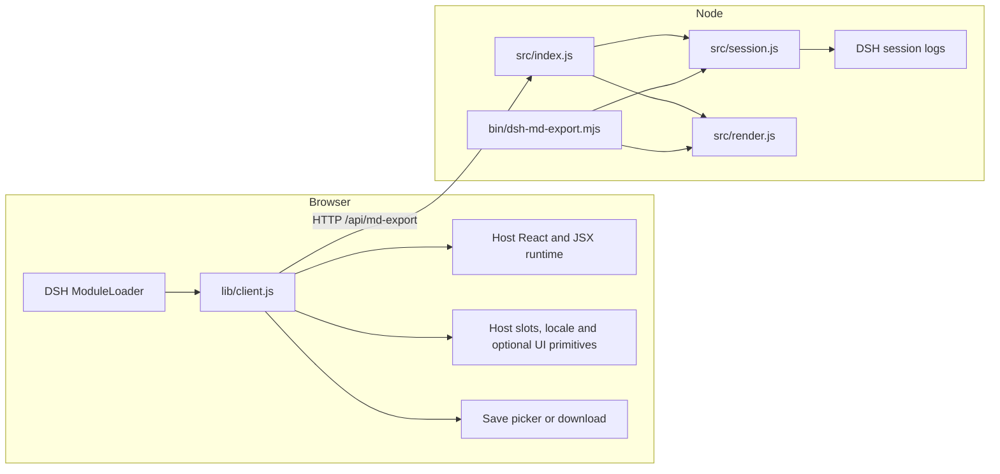

# Architecture

This guide maps the source, interfaces and tests.
[CONTRIBUTING.md](../CONTRIBUTING.md) covers setup and contribution rules;
[FORMAT.md](FORMAT.md) records the session-log shapes and
failure policy.

## Runtime boundaries

The plugin has two entry points loaded by DSH, plus a standalone CLI:

| Entry point | Runtime | Responsibility |
|---|---|---|
| [`src/index.js`](../src/index.js) | DSH host, Node ESM | Register `/api/md-export`, validate requests, read logs and return metadata or Markdown |
| [`lib/client.js`](../lib/client.js) | DSH browser client | Register the header button, use host locale and UI services, fetch the export and save it |
| [`bin/dsh-md-export.mjs`](../bin/dsh-md-export.mjs) | Standalone Node ESM | Parse CLI options and write the shared renderer's output to a file or stdout |

The browser communicates with the host over HTTP; only Node code reads session files.

[`package.json`](../package.json) identifies the host and client entries and the
DSH client injections. [`cordis.patch.yml`](../cordis.patch.yml) inserts the
`md-export` host plugin row into the profile. The host uses `webServer` and
`webRuntime`; the client uses `slots` and `locale`.

`lib/client.js` is **handwritten source**. Its
`window.__ModuleLoader__.load({ id, factory })` wrapper is the format DSH loads;
the factory obtains React and JSX helpers through the host's `require`.
Keep this wrapper: the package ships without dependencies or a build step.

## Reading and rendering

`src/session.js` owns discovery and decoding. It enumerates
`$DSH_HOME/sessions` (default `~/.dsh/sessions`), selects the highest file
generation in each session directory, and returns `{ header, events, version }`.
Compressed logs contain concatenated zstd frames: the reader checks each complete
frame boundary, decompresses that exact slice, and verifies decoder consumption.
See [the format contract](FORMAT.md) for the precise input and failure rules.

`src/render.js` owns interpretation and output. `buildTurns()` combines finalized
events into user/assistant turns and gathers references. Streaming duplicates are
ignored. `renderMarkdown()` applies export options and produces the document;
`extractTitle()` and `extractModel()` also supply the HTTP metadata response.
Title-based filenames and formatting helpers live here so the HTTP and CLI
entries use the same rules. Document event-shape changes in
[FORMAT.md](FORMAT.md#extending-the-contract).

The CLI imports these two modules directly. It does not make HTTP requests and
does not need DSH running. Its metadata URL comes from `DSH_WEB_URL`; the host
uses the current request's origin.

## Browser export lifecycle

The click handler follows this order:

1. Acquire a synchronous operation lock and clear any previous success timer.
2. Refresh metadata (`meta=1`) with a two-second abort timeout. If it fails, use
   the mount-time cache, then the fallback filename.
3. Open `showSaveFilePicker()` with the refreshed name. This must happen before
   fetching the document because the picker requires transient user activation.
4. Fetch the Markdown, then write and close the chosen file. Without a picker,
   save through a Blob URL and an anchor download.
5. Show the saved filename and release the lock in `finally`.

`fetchMeta()` and `fetchExport()` handle HTTP requests; `writeMarkdown()` owns
the writable stream. The component owns the lock, timers and mounted state.

Cancellation returns to idle without fetching the document. Picker errors other
than cancellation use the download fallback. Content or write errors show a
failure; a failed write attempts to abort the writable stream. The filename in
the success toast comes from `handle.name` when the user chose a file.

The synchronous lock prevents repeated clicks before React rerenders. Unmounting
clears timers and suppresses state updates or new dialogs; a file already selected
still finishes saving.

## Conventions across the boundary

The host accepts GET query parameters and POST JSON for `sessionId` and the
optional flags `tools`, `reasoning`, `injected`, `system`, `h1` and `meta`.
Options default to false. Request validation and the loopback/trusted-host fence
belong in `src/index.js`; rendering does not inspect HTTP requests.

With `meta=1`, the JSON response contains `sessionId`, `title`, `filename`,
`model`, `createdAt` and `version`. Otherwise the response is Markdown.

Markdown responses use `text/markdown; charset=utf-8`, `Cache-Control: no-store`,
and a `Content-Disposition` with an ASCII fallback and UTF-8 `filename*`.
`X-Dsh-Filename` is percent-encoded and decoded by the download fallback.
The renderer sanitizes titles and caps the filename stem without leaving half
of a surrogate pair. The browser validates header filenames before using them.

The button is registered with `locale: LOCALE_NS` (`dsh-md-export`). The host
injects `t` into the slot component and rerenders it when the language changes.
Keep English and Chinese dictionary keys aligned. Document labels remain English
independently of UI locale.

The browser factory cannot import host ESM. Keep these constants synchronized:

| Convention | Host/core | Browser |
|---|---|---|
| Route `/api/md-export` | `MD_EXPORT_PATH` in `src/index.js` | `ENDPOINT` in `lib/client.js` |
| Fallback `dsh-<short-id>.md`, removing `session-` and keeping eight characters | `fallbackMarkdownFilename()` in `src/render.js` | `fallbackName()` in `lib/client.js` |

## Where to change things

| Change | Start here | Existing verification |
|---|---|---|
| Log discovery or zstd decoding | `src/session.js` | `test/session.test.mjs`, `test/host.test.mjs`, `test/cli.test.mjs` |
| Event shapes, turns or references | `src/render.js`, `docs/FORMAT.md` | `test/render.test.mjs`, synthetic `test/fixtures.mjs` |
| Filename or formatting rules | `src/render.js` | `test/format.test.mjs`, `test/host.test.mjs` |
| HTTP options, headers or trust checks | `src/index.js` | `test/host.test.mjs` |
| Button, locale or save lifecycle | `lib/client.js` | `test/client.test.mjs` |
| CLI arguments or output paths | `bin/dsh-md-export.mjs` | `test/cli.test.mjs` |
| Profile installation or bundle registration | `install.sh` | `test/install.test.mjs` |
| Published output example | `test/sample.mjs`, both READMEs | `test/readme.test.mjs` compares the examples byte for byte |

`npm test` needs no DSH installation, pnpm or real session data. Client tests
execute the shipped loader factory with a host/React harness and controlled
timers; installer tests use temporary profiles and a pnpm substitute. For changes
to host integration or compatibility, also use the real DSH smoke check described
in [CONTRIBUTING.md](../CONTRIBUTING.md).
